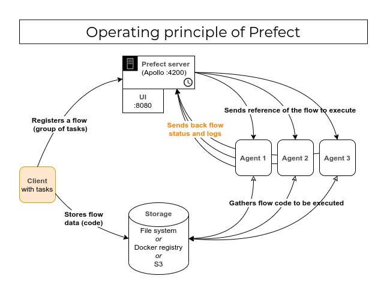
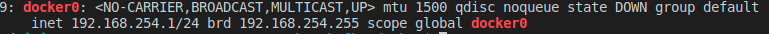

# Prefect - Docker Compose

A simple guide to understand and make Prefect **2.x** work with your own docker-compose configuration.

Interested in examples for Prefect **1.x** ? Switch to the [last 1.x branch of this repo](https://github.com/flavienbwk/prefect-docker-compose/tree/e758a498d5819550a9b926b0bf9bb4e9c85574d1).

This allows you to package your Prefect instance for fully-containerized environments (e.g: docker-compose, Kubernetes) or offline use.



- [Prefect - Docker Compose](#prefect---docker-compose)
  - [Run the server](#run-the-server)
  - [Run one or multiple agents](#run-one-or-multiple-agents)
  - [Run your first flow via the Prefect API](#run-your-first-flow-via-the-prefect-api)
    - [Principles to understand](#principles-to-understand)
    - [Flow with Local storage (easiest)](#flow-with-local-storage-easiest)
    - [Flow with S3 Storage (recommended)](#flow-with-s3-storage-recommended)
    - [Flow with Docker storage](#flow-with-docker-storage)
      - [Preparing the Registry](#preparing-the-registry)
      - [Start the Docker in Docker agent](#start-the-docker-in-docker-agent)
      - [Registering the flow](#registering-the-flow)

## Run the server

1. Optionally open and edit the [`server/.env`](./server/.env) file

    :information_source: All `PREFECT_*` env variables can be [found in the Prefect settings.py file](https://github.com/PrefectHQ/prefect/blob/main/src/prefect/settings.py#L238).

2. Start the server :

    ```bash
    cd server && docker-compose up --build -d && cd -
    ```

3. Access the Orion UI at [localhost:4200](http://localhost:4200)

## Run one or multiple agents

Agents are services that run your scheduled flows.

1. Optionally open and edit the [`agent/docker-compose.yml`](./agent/docker-compose.yml) file.

    > :information_source: In each `docker-compose.yml`, you will find the `PREFECT_API_URL` env variable including the `172.17.0.1` IP address. This is the IP of the Docker daemon on which are exposed all exposed ports of your containers. This allows containers launched from different docker-compose networks to communicate. Change it if yours is different (check your daemon IP by typing `ip a | grep docker0`).
    >
    > 
    >
    > Here, mine is `192.168.254.1` but the default is generally to `172.17.0.1`.

2. Start the agent :

    ```bash
    docker-compose -f agent/docker-compose.yml up -d
    ```

    > :information_source: You can run the agent on another machine than the one with the Prefect server. Edit the `PREFECT_API_URL` env variable for that.

    Maybe you want to instanciate multiple agents ?

    ```bash
    docker-compose -f agent/docker-compose.yml up -d --scale agent=3 agent
    ```

3. Our agents are now starting listening the Orion server on the `flows-example-queue` queue ([see the `--work-queue` option](./agent/docker-compose.yml#L7)).

## Run your first flow via the Prefect API

### Principles to understand

> :speech_balloon: [Execution in your cloud; orchestration in ours](https://medium.com/the-prefect-blog/the-prefect-hybrid-model-1b70c7fd296)

This means the Prefect server never stores your code. It just orchestrates the running (optionally the scheduling) of it.

1. After developing your flow, Prefect will register it to the Orion server [through a Deployment](./client/app/weather.py#L49). In that script, you may ask the server to run your flow 3 times a day, for example.
2. Your code never lies on the Prefect server : this means the code has to be stored somewhere accessible to the agents in order to be executed.

    Prefect has [a lot of storage options](https://docs.prefect.io/tutorials/storage) but the most famous are : Local, S3, Docker and git.
    - Local : saves the flows to be run on disk. So the volume where you save the flows must be [shared among your client and your agent(s)](./client/docker-compose.yml#L9). Requires your agent to have the same environment than your client (Python modules, packages installed etc... (the same Dockerfile if your agent and client are containers))
    - S3 : similar to local, but saves the flows to be run in S3 objects.
    - Docker : saves the flows to be run as Docker images to your Docker Registry so your agents can easily run the code.

### Flow with Local storage (easiest)

:information_source: If your agents are installed among multiple machines, I recommend you to mount a shared directory with SSHFS.

1. Run the following command to register your deployment and run the flow :

    ```bash
    docker-compose -f client/docker-compose.yml up # Executes weather.py
    ```

2. Access the UI to see your flow correctly run

### Flow with S3 Storage (recommended)

<details>
<summary>Tutorial for S3 Storage</summary>
<br/>

We will use [MinIO](https://www.github.com/minio/minio) as our S3 server.

1. Optionally open and edit the [`client_s3/.env`](./client_s3/.env) file and start MinIO

    ```bash
    docker-compose -f client_s3/docker-compose.yml up -d minio # Starts MinIO
    ```

2. Register the flow :

    ```bash
    docker-compose -f client_s3/docker-compose.yml up weather # Executes weather.py
    ```

Now your flow is registered. You can access the UI to run it.

</details>

### Flow with Docker storage

This method requires our client AND agent containers to have access to Docker so they can package or load the image in which the flow will be executed. We use _Docker in Docker_ for that.

<details>
<summary>Tutorial for (secure) Docker Storage</summary>

#### Preparing the Registry

A Docker Registry is needed in order to save images that are going to be used by our agents.

1. Generate the authentication credentials for our registry

    ```bash
    sudo apt install apache2-utils # required to generate basic_auth credentials
    cd client_docker/registry/auth && htpasswd -B -c .htpasswd myusername && cd -
    ```

    > To add more users, re-run the previous command **without** the -c option

2. Start the registry

    ```bash
    docker-compose -f client_docker/docker-compose.yml up -d registry
    ```

3. Login to the registry

    You need to allow your Docker daemon to push to this registry. Insert this in your `/etc/docker/daemon.json` (create if needed) :

    ```json
    {
      "insecure-registries": ["172.17.0.1:5000"]
    }
    ```

4. Start the registry

    ```bash
    docker login http://172.17.0.1:5000 # with myusername and the password you typed
    ```

    You should see : _Login Succeeded_

#### Start the Docker in Docker agent

Optionally edit registry credentials in [`./agent_docker/docker-compose.yml`](./agent_docker/docker-compose.yml) and run :

```bash
docker-compose -f agent_docker/docker-compose.yml up --build -d
```

#### Registering the flow

We're going to push our Docker image with Python dependencies and register our flow.

1. Build, tag and push the image

    ```bash
    docker build . -f ./client_docker/execution.Dockerfile -t 172.17.0.1:5000/weather/base_image:latest
    ```

    > You **must** prefix your image with the registry URI `172.17.0.1:5000` to push it

    ```bash
    docker push 172.17.0.1:5000/weather/base_image:latest
    ```

2. Register the flow

    Optionally edit registry credentials in `./client_docker/docker-compose.yml` and run :

    ```bash
    docker-compose -f ./client_docker/docker-compose.yml up --build weather
    ```

Now your flow is registered. You can access the UI to run it.

</details>
